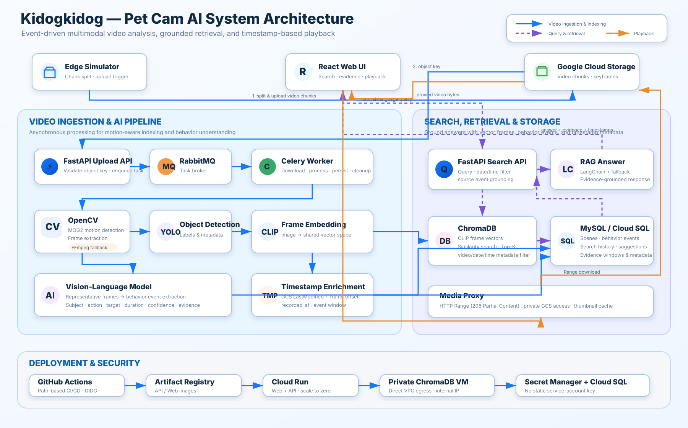

# Kidogkidog 포트폴리오 정리

> 이 문서는 저장소의 현재 코드와 Git 이력을 기준으로 작성했다. 이력서, 포트폴리오 상세 페이지, 면접 답변에 필요한 문장을 목적별로 골라 사용할 수 있다.



## 1. 한 줄 소개

반려동물 영상에서 사용자가 자연어로 행동을 검색하면, AI가 관련 행동 구간과 근거 프레임을 찾아 해당 시점의 영상을 재생해 주는 멀티모달 Video RAG 서비스입니다.

## 2. 프로젝트 개요

- 프로젝트명: Kidogkidog
- 개발 형태: 2인 팀 프로젝트
- 담당 역할: Backend & Data Pipeline Lead
- 핵심 기술: Python, FastAPI, Celery, RabbitMQ, OpenCV, FFmpeg, YOLOv8, CLIP, ChromaDB, MySQL, React, TypeScript, GCS, Cloud Run, GitHub Actions
- 핵심 사용자 경험: “강아지가 물을 마신 장면 보여줘”처럼 자연어로 질문하고, 답변의 근거가 된 행동 구간과 실제 영상을 함께 확인

## 3. 포트폴리오 본문 초안

### 문제 정의

장시간 녹화되는 펫캠 영상은 원하는 장면을 찾기 위해 사용자가 타임라인을 직접 탐색해야 합니다. 이를 해결하기 위해 영상 전체를 단순 저장하는 데 그치지 않고, 의미 있는 행동 구간을 자동으로 선별·해석·검색하여 자연어 질문에서 실제 재생 시점까지 연결하는 서비스를 구현했습니다.

### 핵심 구현

#### 1) 이벤트 기반 비동기 영상 처리 파이프라인

Edge Simulator가 영상을 청크 단위로 분할해 GCS에 업로드하면 FastAPI가 Celery 작업을 등록하고, RabbitMQ와 분리된 Worker가 영상 분석을 수행하도록 구성했습니다. 무거운 영상 처리와 사용자 요청 경로를 분리해 API 응답 흐름이 분석 작업에 직접 묶이지 않도록 설계했습니다.

Worker에서는 다음 과정을 하나의 파이프라인으로 연결했습니다.

```text
GCS 영상 다운로드
→ 모션 구간 감지
→ 대표 프레임 추출
→ YOLO 객체 탐지
→ CLIP 이미지 임베딩
→ ChromaDB 벡터 저장
→ MySQL 장면/행동 메타데이터 저장
→ 임시 파일 정리
```

#### 2) 분석 비용을 줄이기 위한 모션 기반 프레임 선별

모든 프레임을 동일하게 분석하지 않고 OpenCV MOG2 배경 차분으로 움직임이 있는 구간을 먼저 탐지한 뒤, 해당 구간에서만 일정 간격으로 프레임을 추출했습니다. 분석용 프레임은 폭 640px로 축소하고 샘플링 FPS를 분리하여 연산량을 제어했습니다. OpenCV가 AV1 등 일부 코덱을 읽지 못하거나 모션 구간을 만들지 못하는 경우에는 FFmpeg 기반 전체 구간 샘플링으로 전환하는 fallback도 구현해 입력 영상 호환성을 보완했습니다.

#### 3) 프레임 유사도와 행동 이벤트를 결합한 Video RAG

CLIP으로 이미지와 자연어를 같은 임베딩 공간에서 검색하고, YOLO 객체 라벨과 VLM이 생성한 행동 이벤트를 함께 검색 근거로 사용했습니다. 행동 이벤트에는 시작·종료 시점, 행동 주체, 대상, 지속 시간, 반복 횟수, 신뢰도와 근거 프레임을 저장했습니다. 검색 결과를 단순 유사 프레임 목록으로 끝내지 않고 LangChain 기반 답변 컨텍스트와 연결하여, 사용자가 “무엇을 했는지”와 “어느 장면에서 확인할 수 있는지”를 함께 받도록 구성했습니다.

추천 질문에서 특정 행동 이벤트를 선택한 경우에는 해당 이벤트 시간 범위 안에서 다시 프레임을 검색합니다. 이를 통해 추천 문구와 실제 영상 근거가 서로 다른 장면을 가리키는 문제를 줄였습니다. ChromaDB나 LLM을 사용할 수 없는 상황에서도 저장된 행동 이벤트와 객체 라벨을 이용해 결과를 반환하도록 단계별 fallback을 설계했습니다.

#### 4) 촬영 시각을 보존하는 검색·재생 경험

영상 청크의 GCS `LastModified`와 프레임의 상대 timestamp를 결합해 각 프레임의 실제 촬영 시각을 저장했습니다. 검색 API에 날짜 및 시간대 필터를 추가하고, React UI에서 검색 결과를 해당 청크의 재생 위치와 연결해 사용자가 결과 카드에서 바로 근거 장면을 확인할 수 있도록 구현했습니다.

비공개 GCS 영상을 브라우저에서 탐색할 수 있도록 FastAPI 미디어 프록시에 HTTP Range 요청을 구현했습니다. 부분 바이트 응답(`206 Partial Content`)과 `Content-Range` 헤더를 반환하여 전체 파일을 먼저 내려받지 않고도 영상 탐색과 구간 재생이 가능하도록 했습니다. 썸네일은 FFmpeg로 생성하고 임시 디렉터리에 캐시했습니다.

#### 5) 운영 환경을 고려한 GCP 배포 자동화

API와 Web을 각각 Docker 이미지로 구성하고, GitHub Actions에서 변경 경로를 판별해 수정된 컴포넌트만 빌드·검증·배포하도록 구성했습니다. `main` CI 성공 이후 동일 커밋을 Cloud Run 스테이징에 배포하며, GitHub OIDC/Workload Identity Federation과 Secret Manager를 사용해 장기 서비스 계정 키와 애플리케이션 비밀값을 저장소에서 분리했습니다.

Cloud Run API는 Cloud SQL Connector로 MySQL에 접속하고, Direct VPC egress로 외부에 공개하지 않은 ChromaDB VM의 내부 IP에 접근합니다. 유휴 시 scale-to-zero가 가능하도록 API를 Cloud Run에 두고, 공용 벡터 인덱스가 필요한 ChromaDB만 VM에 유지하는 구조로 테스트 환경의 비용과 접근 범위를 함께 고려했습니다.

### 담당 기여

- 영상 청크 분할, 모션 감지, 프레임 추출, 객체 스토리지 연동으로 이어지는 전처리 파이프라인 구현
- FastAPI–Celery–RabbitMQ 기반 비동기 영상 분석 흐름 및 CLIP/ChromaDB 인덱싱 연동
- 검색·녹화 영상·행동 하이라이트를 확인하는 React UI와 API 연동
- S3 중심 구조를 GCS로 마이그레이션하고 Cloud SQL, 내부 ChromaDB와 연결되는 GCP 스테이징 아키텍처 구성
- GitHub Actions 기반 경로별 CI 및 Cloud Run 자동 배포 구축
- AV1/OpenCV 디코딩 실패를 FFmpeg fallback으로 보완하고 프레임 촬영 시각 저장 오류 수정

> Git 이력에는 박도연/Doyeon/do-dop 계정 기준 76개 커밋(merge 포함)이 확인된다. 지원서에는 커밋 수보다 위의 기능 단위 기여를 우선 제시하는 편이 좋다.

## 4. 이력서용 압축 문장

### 3줄 버전

- 자연어 질문으로 반려동물 행동 장면을 검색하고 근거 영상을 재생하는 멀티모달 Video RAG 서비스를 2인 팀으로 개발
- FastAPI·Celery·RabbitMQ 기반 비동기 파이프라인에 모션 감지, YOLO, CLIP, ChromaDB, VLM 행동 분석을 연결
- GCS·Cloud SQL·Private ChromaDB·Cloud Run 아키텍처와 GitHub Actions CI/CD를 구축하고 React 검색/재생 UI까지 구현

### 백엔드 직무 강조 버전

- 고비용 영상 분석을 API 요청 경로에서 분리하기 위해 FastAPI–RabbitMQ–Celery Worker 구조를 설계하고, 영상 수집부터 벡터 인덱싱·메타데이터 저장까지 자동화
- HTTP Range 기반 비공개 GCS 미디어 프록시를 구현해 대용량 영상을 전체 다운로드하지 않고 탐색·재생할 수 있도록 개선
- ChromaDB/LLM 장애 시에도 행동 이벤트와 메타데이터로 검색 결과를 반환하는 다단계 fallback을 구성해 기능 저하 상황의 가용성을 확보

### AI/데이터 직무 강조 버전

- 모션 기반 프레임 선별, YOLO 객체 탐지, CLIP 임베딩, VLM 행동 요약을 결합한 멀티모달 영상 인덱싱 파이프라인 구현
- 프레임 유사도만 사용하던 검색을 시간 구간이 있는 행동 이벤트 중심 RAG로 확장해 답변과 실제 재생 장면의 근거 일관성을 강화
- 날짜·시간대·영상 ID 필터 및 질의 확장 로직을 적용해 영상 검색의 범위와 문맥을 제어

### DevOps/클라우드 강조 버전

- API/Web Docker 이미지를 분리하고 변경 경로 기반 선택적 CI/CD를 구축하여 불필요한 컴포넌트 빌드와 배포를 방지
- GitHub OIDC, Secret Manager, Cloud SQL Connector, Direct VPC egress를 적용해 정적 인증 키와 공개 DB 포트 없이 스테이징 환경 구성
- Cloud Run scale-to-zero API와 내부 IP 기반 ChromaDB VM을 조합해 AI 모델 메모리 요구사항, 공용 인덱스 유지, 유휴 비용을 함께 고려

## 5. STAR 면접 답변 소재

### 사례 A — 영상 코덱 호환성 문제

- Situation: 일부 AV1 영상에서 OpenCV가 FPS나 프레임을 정상적으로 읽지 못해 인덱싱 결과가 비어 버리는 문제가 발생
- Task: 특정 코덱 실패가 전체 영상 처리 실패로 이어지지 않도록 입력 호환성 확보
- Action: 모션 구간이 없거나 OpenCV 디코딩이 불가능한 경우 FFmpeg로 일정 FPS의 프레임을 추출하는 fallback 경로를 추가하고, fallback 프레임에도 timestamp와 segment metadata를 생성
- Result: OpenCV 단일 디코더에 의존하지 않고 해당 영상을 검색 인덱싱 파이프라인에 포함할 수 있도록 복구

### 사례 B — 추천 질문과 근거 영상의 불일치

- Situation: 행동 이벤트에서 만든 추천 질문이 일반 CLIP 검색을 다시 거치며 원래 이벤트와 다른 장면을 반환할 수 있었음
- Task: AI 답변, 추천 질문, 실제 재생 영상 사이의 근거 일관성 확보
- Action: 추천 질문에 `source_event_id`와 이벤트 시간 범위를 전달하고, 해당 구간 안에서만 후보 프레임을 다시 선택하는 event-grounded 검색 경로 구현
- Result: 추천 질문이 생성된 행동 구간과 사용자에게 제시되는 근거 프레임·재생 구간을 동일한 이벤트로 연결

### 사례 C — 스테이징 보안과 비용의 균형

- Situation: 팀원이 동일한 벡터 인덱스로 검색 품질을 확인해야 했지만 ChromaDB 포트를 인터넷에 공개하거나 상시 고비용 서버를 유지하고 싶지 않았음
- Task: 공용 테스트 환경의 접근성, 보안, 비용을 함께 만족하는 배포 구조 설계
- Action: API는 scale-to-zero Cloud Run에 배포하고 Direct VPC egress로 내부 IP의 ChromaDB VM에 접근하도록 구성. Cloud SQL Connector, Workload Identity Federation, Secret Manager로 DB와 배포 인증을 분리
- Result: ChromaDB를 외부에 공개하지 않으면서 팀 공용 인덱스를 유지하고, API 유휴 비용과 장기 인증 키 관리 부담을 줄이는 구조 확립

## 6. 면접에서 설명할 설계 판단

- 왜 전체 프레임이 아니라 모션 구간만 분석했는가: 장시간 고정 카메라 영상의 중복 프레임을 줄여 후속 객체 탐지·임베딩·VLM 호출 대상을 제한하기 위해서다.
- 왜 ChromaDB와 MySQL을 함께 사용했는가: ChromaDB는 자연어-이미지 유사도 검색에, MySQL은 시간 구간·행동 이벤트·검색 이력처럼 관계형 조회와 집계가 필요한 데이터에 각각 사용했다.
- 왜 행동 이벤트를 별도로 만들었는가: 단일 프레임 임베딩만으로는 ‘반복해서 그릇을 건드렸다’처럼 시간에 걸친 행동을 표현하기 어렵기 때문이다.
- 왜 미디어를 presigned URL만으로 노출하지 않았는가: 브라우저 재생에 필요한 Range 요청을 서버에서 통제하고 비공개 버킷 접근을 API 경계 안에 유지하기 위해 미디어 프록시를 사용했다.
- 왜 Celery concurrency를 제한했는가: CLIP, YOLO, 프레임 처리 작업은 메모리 사용량이 크므로 로컬/단일 워커 환경에서 병렬 작업으로 인한 자원 고갈을 피하기 위한 선택이다.

## 7. 수치로 보강해야 할 항목

현재 저장소만으로 검증할 수 없어 아래 값은 포트폴리오에 임의로 넣지 않았다. 같은 테스트 영상과 환경을 고정한 뒤 측정하면 프로젝트 설득력이 크게 높아진다.

- 모션 선별 전후 추출 프레임 수 및 감소율
- 영상 1분당 인덱싱 소요 시간과 단계별 처리 시간
- 자연어 검색 응답 지연 시간의 평균/P95
- 대표 질의 세트의 Top-k 적중률 또는 사용성 평가 결과
- 컨테이너 이미지 캐시 및 선택 배포 적용 전후 CI/CD 시간
- GCS 전체 다운로드 대비 Range 요청의 초기 재생 시간 및 전송량

성과 문장은 측정 후 다음 형식으로 작성한다.

> 10분 길이 펫캠 영상 5개를 기준으로 모션 기반 선별을 적용해 분석 프레임을 평균 `[A]%` 줄였고, 영상당 인덱싱 시간을 `[B]분 → [C]분`으로 단축했습니다.

## 8. 현재 코드 기준 개선 우선순위

1. 자동화 테스트 추가: 검색 필터, Range 응답, 이벤트 구간 매핑, fallback 경로를 회귀 테스트로 보호
2. 관측 가능성 확보: Celery 작업별 처리 시간, 실패 단계, 검색 latency를 구조화 로그와 지표로 수집
3. 품질 평가 세트 구축: 질문–정답 구간 데이터셋을 만들고 Recall@K/MRR로 검색 변경의 효과를 비교
4. 작업 멱등성 강화: 동일 청크 재처리 시 ChromaDB와 MySQL에 중복 데이터가 쌓이지 않도록 idempotency key 또는 upsert 적용
5. 대형 컴포넌트 분리: 단일 `App.tsx`를 화면·API hook·재생 컴포넌트로 분리해 유지보수성과 테스트 가능성 개선

## 9. 표현 시 주의사항

- “실시간”보다는 현재 구현에 맞는 “이벤트 기반 비동기 처리” 또는 “준실시간 분석”이라고 표현한다.
- 정확도, 비용 절감률, 처리속도는 측정값 없이 숫자를 제시하지 않는다.
- 현재 배포 워크플로는 API와 Web 중심이며 Celery/RabbitMQ는 스테이징에 상시 배포되지 않았으므로 전체 파이프라인을 완전한 프로덕션 운영이라고 표현하지 않는다.
- 팀원의 AI 추천 질문·YOLO·RAG 기여를 개인 단독 성과로 말하지 않고, 본인의 파이프라인/통합/배포 기여와 팀 공동 구현을 구분한다.
